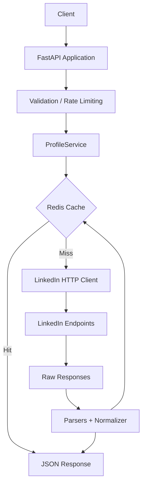

# LinkedIn Profile API Architecture

## System Diagram

## Request Lifecycle
1. **Client Request**: Receives a POST with a LinkedIn profile URL.
2. **Validation**: The URL is validated using regex to ensure it is a valid LinkedIn profile.
3. **Rate Limiting**: IP-based rate limiting is applied via Redis.
4. **Resolution**: The URL is parsed into a core `ProfileIdentity` (the profile slug).
5. **Cache Check**: The system checks Redis for the parsed response. If present, returns immediately.
6. **Provider Fetch**: On cache miss, `LinkedInClient` fetches the profile data (headers, auth, timeout).
7. **Parsing & Normalization**: Raw JSON is safely parsed into application-specific schemas. Collections are deduplicated, and dates/locations are normalized.
8. **Caching & Return**: The final `ProfileResponse` is cached in Redis and returned to the client.

## Design Decisions
- **Separation of Concerns**: HTTP integrations (`LinkedInClient`) are completely separate from API handling (`routers`), and parsed via a dedicated Normalizer. This ensures upstream schema changes don't bleed into the API.
- **Fail Gracefully**: Missing fields are handled gracefully and mapped to null/empty arrays rather than throwing 500s.
- **Protocol based Provider**: `ProfileProvider` uses Python `Protocol` to allow mocking or easily swapping to a different source in the future without changing the Service logic.
